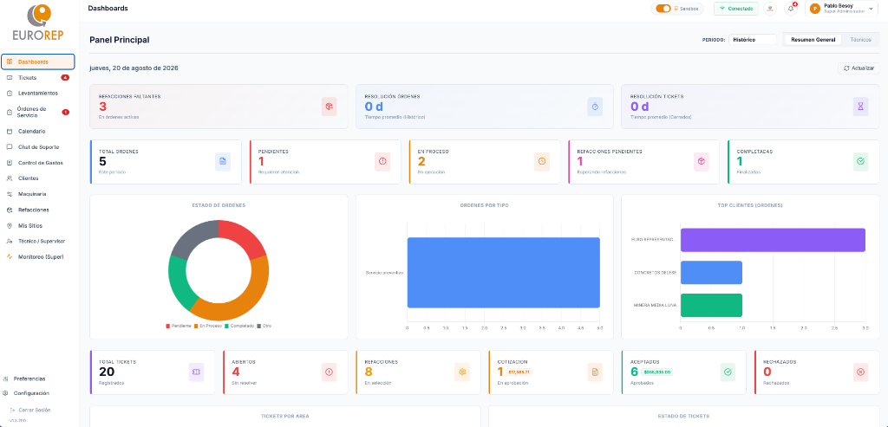

# Manual de Uso: Administrador y Supervisor (SAPI Postventa)

Esta guía te guiará paso a paso en el uso de la consola administrativa y operativa de **SAPI Postventa**. Desde aquí controlarás la asignación de servicios de campo, el calendario de los técnicos, la auditoría de reportes terminados, la nómina semanal de viáticos y la sincronización con SAP Business One.

---

## 📊 1. Monitoreo Global y Dashboards

Al iniciar sesión con perfil `superadmin`, `admin` o `supervisor`, accederás al **Dashboard Administrativo**:
* **KPIs de Operación**: Verás tarjetas con el total de tickets abiertos, órdenes en proceso, levantamientos pendientes y técnicos libres.
* **Mapa de Maquinaria**: Visualiza la ubicación geográfica de todos tus equipos registrados y las obras activas (sitios) sobre el mapa interactivo.
* **Alertas Rápidas**: Avisos si hay tickets críticos sin asignar o reportes de servicios atrasados que superen la fecha de compromiso.

---

## 🎫 2. Gestión y Asignación de Tickets de Soporte

Los tickets de soporte son solicitudes de clientes o fallos urgentes. Para gestionarlos:

1. Selecciona **"Tickets"** en el menú de la barra lateral.
2. Haz clic sobre cualquier ticket de la lista para ver su descripción, archivos adjuntos y comentarios.
3. **Asignación a un Técnico**:
   * Dentro del detalle del ticket, localiza el selector **"Asignado A"**.
   * Elige al técnico adecuado de la lista. El sistema enviará una notificación interna y agregará de forma automática el servicio en el calendario personal de ese técnico.
4. **Respuesta y Comentarios (Internos)**:
   * Escribe actualizaciones, notas o dudas directamente en el chat interno del ticket para coordinarte con el equipo operativo y los técnicos. Este chat es estrictamente interno (privado) y el cliente no tiene acceso a él.
5. **Cierre de Ticket**:
   * Una vez resuelta la falla y completada la orden de servicio en campo, cambia el estatus del ticket a **Cerrado**.

---

## 📅 3. Control del Calendario Administrativo

El calendario central permite organizar la agenda de todo el equipo técnico para evitar empalmes de horarios y controlar incidencias administrativas:

1. Ve a la sección **"Calendario"** en el menú lateral.
2. Para programar una actividad o bloquear la agenda de un técnico:
   * Haz clic sobre el día y hora deseados en la cuadrícula del calendario.
   * Completa los campos en la ventana emergente:
     * **Título**: Nombre de la actividad (ej. *"Capacitación de Motores"*, *"Vacaciones"*).
     * **Técnico**: Selecciona el nombre del técnico de la lista.
     * **Tipo de Evento**: Elige entre *Junta*, *Capacitación*, *Vacaciones*, *Descanso*, *Servicio* u *Otro*.
     * **Orden de Servicio Relacionada**: Opcionalmente, selecciona una orden de servicio existente de la lista para vincularla a esta actividad en el calendario.
     * **Fecha y Hora de Inicio / Fin**.
     * **Color**: Asigna un color distintivo para identificarlo visualmente.
   * Haz clic en **"Crear Evento"** (o guardar).
3. El técnico verá de inmediato esta actividad u orden asignada en su celular en tiempo real. Si es un bloqueo (como descanso o vacaciones), impedirá que se le asignen servicios de campo en esas fechas.

---

## 📝 4. Cierre y Auditoría de Órdenes de Servicio

Cuando un técnico completa una hoja de servicio en campo, debes auditarla antes de procesarla comercialmente:

1. Ve a **"Órdenes de Servicio"** en el menú lateral.
2. Identifica las órdenes marcadas con estatus **"Realizado"** o **"Completado"**.
3. Abre el detalle de la orden para revisar:
   * **Tiempos registrados**: Horas de viaje (traslados ida y vuelta) y horas efectivas de trabajo en sitio.
   * **Bitácoras técnicas**: Notas redactadas sobre el estado del equipo.
   * **Horómetro capturado**: Comprueba que el técnico haya reportado el horómetro del equipo.
   * **Refacciones consumidas**: Detalle de piezas utilizadas para descontar de inventario.
   * **Firmas**: Comprueba que aparezcan las firmas digitales del cliente de conformidad y la firma del técnico.
4. Si todo es correcto, aprueba la orden. Si hay errores (ej. omitieron el horómetro o las refacciones), puedes escribirle un comentario interno al técnico para que corrija la información en su dispositivo móvil.

---

## 💵 5. Generación del Reporte Semanal de Técnicos

Este reporte automatiza el cálculo de pagos, viáticos y control de asistencia semanal del equipo técnico:

1. En la parte superior de la sección de técnicos o servicios, haz clic en **"Reporte Semanal de Técnicos"**.
2. **Seleccionar Semana**:
   * Elige cualquier fecha del calendario. El sistema calculará automáticamente la semana completa (de Lunes a Domingo) y mostrará los rangos correspondientes.
3. **Interpretación de la Tabla**:
   * El sistema genera una cuadrícula donde cada fila representa a un técnico y las columnas corresponden a los días de la semana.
   * **Colores de Referencia**:
     * **Amarillo / Accent**: Días en los que el técnico completó un servicio (Servicio Realizado).
     * **Azul**: Días en los que tiene un servicio programado pero pendiente (Servicio Programado).
     * **Morado**: Días de vacaciones cargadas en el calendario.
   * **Reporte Enviado**: Indica si el técnico ya mandó sus comprobantes semanales.
   * **Días con Servicio**: Conteo automático de días laborados en campo.
   * **Pago Sugerido ($)**: Cálculo sugerido basado en la cantidad de servicios realizados y viáticos aplicables.
   * **Observaciones**: Caja de texto libre para añadir anotaciones administrativas (ej. *"Pendiente de comprobar casetas del día martes"*).
4. **Exportación**:
   * Haz clic en el botón **"Exportar CSV"** para descargar la tabla en formato Excel/CSV y mandarla al área de administración o nóminas de Eurorep.

---

## ⚙️ 6. Gestión de Catálogos y Mapeo Dinámico

Para mantener la base de datos alineada con las necesidades operativas:

### Catálogos (Clientes, Maquinaria, Refacciones, Sitios)
* Ve a las secciones correspondientes en la barra lateral para dar de alta registros manualmente, corregir series de maquinaria o ajustar direcciones de sitios.

### Mapeo de Columnas Personalizadas
Si requieres que las tablas de Clientes, Refacciones o Maquinaria muestren columnas específicas extraídas de SAP o campos nuevos:
1. Haz clic en **"Configurar Mapeos"** o **"Ajustes de Tablas"**.
2. Selecciona la pestaña del módulo a configurar (ej. *Clientes*).
3. Añade el nombre del campo en Supabase y la etiqueta con la que quieres que se muestre en pantalla.
4. Guarda los cambios. Toda la interfaz de la aplicación se actualizará dinámicamente con los nuevos encabezados.

---

## 🔄 7. Sincronización Manual con SAP Business One

Aunque existe un cron automático diario, puedes forzar la sincronización manual para actualizar stocks o cotizaciones urgentes:

1. Ve a **"Preferencias"** o **"Ajustes"** en el menú lateral.
2. Localiza la sección de **Integración SAP B1**.
3. Verás una lista de módulos sincronizables: *Clientes, Refacciones, Sitios, Técnicos, Cotizaciones, Pedidos*.
4. Haz clic en **"Sincronizar Todo"** o en el botón de recarga al lado del módulo específico que desees sincronizar.
5. El sistema llamará al backend de integración, iniciará sesión de manera transparente en la Service Layer de SAP, procesará las consultas SQL correspondientes y actualizará Supabase. Verás una barra de progreso que indicará cuando la sincronización haya concluido con éxito.
