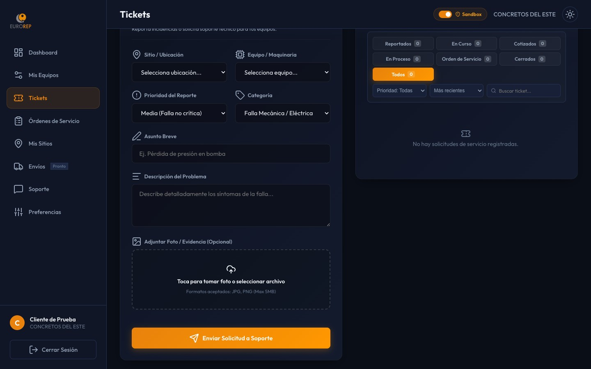

# Manual de Uso: Portal del Cliente (SAPI Postventa)

Esta guía te guiará paso a paso sobre cómo utilizar el **Portal del Cliente de Eurorep**, desde dónde podrás gestionar de forma autónoma las solicitudes de servicio para tus equipos, chatear con soporte en tiempo real y revisar el historial de mantenimientos.

---

## 🔑 1. Acceso y Registro al Portal

El portal del cliente está disponible a través de una dirección web específica provista por el administrador (ejemplo: `cliente.html` o un subdominio asignado).

### Cómo registrarse (Si es tu primera vez):
1. En la pantalla de inicio, haz clic en **"Registrarse"** o **"Crear Cuenta"**.
2. Completa los siguientes campos obligatorios:
   * **Nombre completo**: Tu nombre y apellido.
   * **Correo electrónico**: Será tu usuario para ingresar.
   * **Teléfono**: Número de contacto directo.
   * **Empresa**: Selecciona o escribe el nombre de la empresa/razón social a la que perteneces (este nombre debe coincidir con el registro en Eurorep).
   * **Contraseña**: Define una contraseña segura de al menos 6 caracteres.
3. Haz clic en **"Registrarse"**. Tu cuenta quedará creada en estado "Pendiente de Aprobación". 
4. > [!NOTE]
   > Un administrador de Eurorep validará que pertenezcas a la empresa indicada y activará tu cuenta en un lapso máximo de 24 horas. Recibirás una notificación por correo cuando tu cuenta esté activa.

### Cómo iniciar sesión:
1. Escribe tu **correo electrónico** y **contraseña** registrados.
2. Haz clic en **"Iniciar Sesión"**.
3. Accederás directamente al Panel de Control (Dashboard).

---

## 📊 2. Panel Principal (Dashboard)

Al ingresar, verás un resumen de la actividad de tus equipos:
* **Mis Equipos**: Cantidad total de maquinaria que tienes registrada y activa con Eurorep.
* **Tickets Abiertos**: Reportes de falla o solicitudes de soporte que están siendo atendidos actualmente.
* **Servicios Realizados**: Cantidad total de mantenimientos preventivos y correctivos ejecutados históricamente.
* **Gráfica de Estatus**: Un vistazo rápido para ver cuántos reportes están en estatus *Pendiente*, *En Proceso* o *Completados*.

---

## ⚙️ 3. Mis Equipos (Control de Maquinaria)

En el menú lateral, selecciona **"Mis Equipos"** para ver todo tu parque de maquinaria:
* Verás una lista con la tarjeta de cada máquina detallando: **Número de Serie**, **Marca**, **Modelo**, **Ubicación actual (Sitio)** y **Estatus del Equipo**.
* **Buscador rápido**: Puedes escribir el modelo o serie en la barra de búsqueda superior para encontrar un equipo en segundos.
* **Reportar Falla Rápida**: Si un equipo presenta un problema:
  1. Identifica el equipo en la lista.
  2. Haz clic en el botón rojo **"Reportar Falla"** ubicado dentro de su tarjeta.
  3. El portal abrirá automáticamente el formulario de creación de ticket con los datos de la máquina ya precargados para ahorrarte tiempo.

---

## 🎫 4. Cómo Reportar un Problema (Crear un Ticket)

Si necesitas solicitar soporte técnico, refacciones o reportar una avería, sigue estos pasos:

1. Ve a la sección **"Tickets"** en el menú lateral.
2. Haz clic en el botón **"Nuevo Ticket"** (esquina superior derecha).
3. Completa el formulario de solicitud:
   * **Asunto**: Un título breve del problema (ej. *"Fuga de aceite en motor principal"*).
   * **Sitio / Ubicación**: Selecciona de la lista en qué obra o planta se encuentra el equipo.
   * **Equipo / Maquinaria**: Selecciona el número de serie o modelo del equipo que presenta el fallo.
   * **Categoría**: Selecciona el tipo de requerimiento (ej. *Servicio Correctivo*, *Preventivo*, *Refacciones*, *Garantía*).
   * **Prioridad**: Define el nivel de urgencia (*Baja*, *Media*, *Alta*, *Crítica*).
   * **Descripción**: Explica detalladamente los síntomas del fallo, códigos de error en pantalla o lo que necesitas.
   * **Adjuntar Fotografía / Evidencia**: Haz clic en el botón de la cámara para subir una foto del problema directamente desde tu celular o computadora.
4. Haz clic en **"Enviar Solicitud"**.
5. ¡Listo! El sistema generará un número de folio automático (ej. `T-26001`) y notificará al supervisor de Eurorep.

---

## 📋 5. Seguimiento y Respuesta a Cotizaciones

En la sección **"Tickets"** verás el listado de todos tus folios. Haz clic sobre cualquiera de ellos para ver su detalle e interactuar:

### Historial y comentarios:
* Puedes escribir dudas u observaciones en la caja de comentarios inferior y hacer clic en **"Enviar"**. El equipo técnico de Eurorep las recibirá y responderá de inmediato.

### Autorización de Cotizaciones de SAP:
Cuando un ticket requiere refacciones o un servicio especial que genere costo:
1. El equipo de Eurorep subirá la **Cotización SAP** oficial en formato PDF.
2. Verás el monto en pantalla y un botón para **"Ver PDF Cotización"**.
3. Tendrás dos botones de acción rápida:
   * **Aceptar Cotización**: Si estás de acuerdo, haz clic en este botón. Se notificará a Eurorep para programar el servicio y generar el pedido SAP.
   * **Rechazar Cotización**: Si no estás de acuerdo, haz clic en este botón. Deberás escribir obligatoriamente el **motivo del rechazo** para que el área de ventas evalúe alternativas.

---

## 📝 6. Hojas de Servicio (Órdenes de Servicio)

Cada vez que un técnico de Eurorep visita tu sitio y repara un equipo, genera una **Orden de Servicio** digital.

### Cómo consultarlas y descargarlas:
1. Selecciona **"Órdenes de Servicio"** en el menú lateral.
2. Verás el listado de servicios con su estatus (ej. *Pendiente*, *Realizado*).
3. Haz clic sobre cualquier orden para ver la bitácora completa redactada por el técnico, las horas laboradas, las refacciones empleadas y la firma de conformidad digital recolectada.
4. Haz clic en **"Visualizar PDF"** o **"Descargar PDF"** para obtener el reporte oficial en tu computadora o celular para tus archivos internos.

---

## 💬 7. Chat de Soporte

Si necesitas hablar directamente con el personal administrativo o de ventas sin abrir un ticket formal:
1. Haz clic en **"Soporte"** en el menú lateral.
2. Se abrirá la ventana del chat.
3. Escribe tu mensaje y presiona Enter o haz clic en enviar.
4. Si hay personal en línea, recibirás respuesta de inmediato. Verás un globo rojo con el número de mensajes no leídos en la barra lateral si recibes respuestas mientras navegas en otras secciones del portal.
