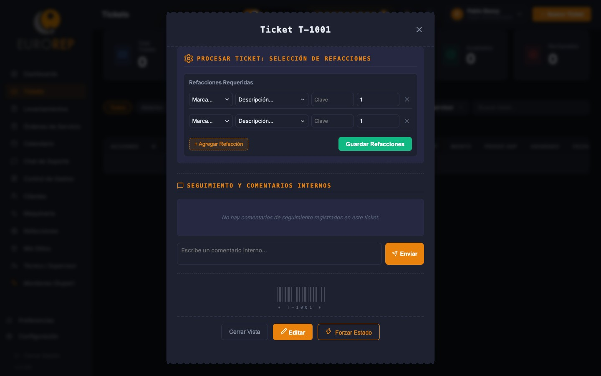
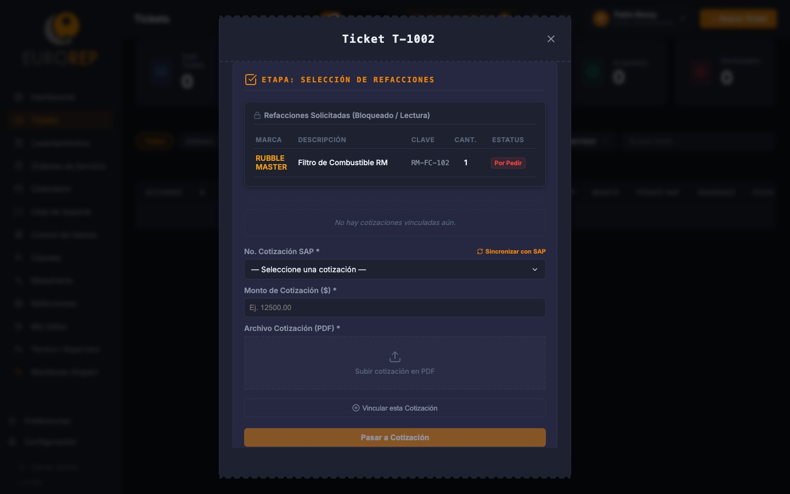
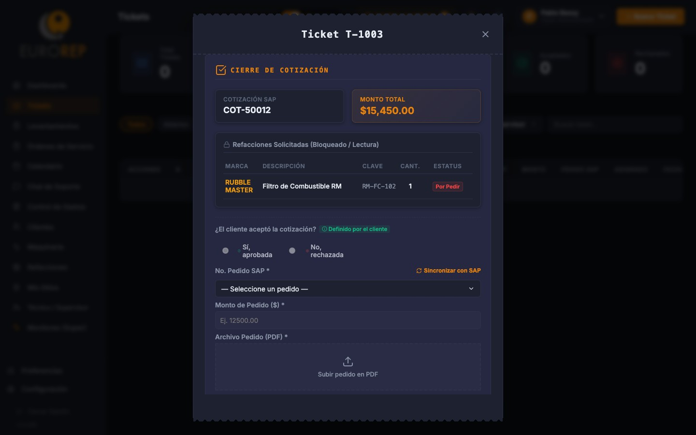

# Manual de Flujo Completo del Sistema (SAPI Postventa)

Este manual describe el ciclo de vida completo de un servicio de mantenimiento dentro de la plataforma **SAPI Postventa** de Eurorep, detallando la interacción de cada rol (Cliente, Administrador, Técnico) y la integración automatizada del sistema con Supabase, Microsoft OneDrive y SAP Business One.

---

## 🔄 Diagrama del Flujo de Trabajo End-to-End

El ciclo de servicio sigue una secuencia lineal obligatoria para garantizar la trazabilidad del trabajo y la facturación:

1. **Solicitud** (Cliente crea Ticket en el Portal) 
2. **Procesamiento de Ticket** (Administrador analiza el ticket, agrega refacciones, vincula cotización SAP y pedido SAP)
3. **Programación** (Administrador programa y asigna la OS en el Calendario)
4. **Planificación** (Técnico precarga la OS para trabajo Offline)
5. **Ejecución en Campo** (Firma de Inicio, Bitácora Diaria, Refacciones, Firma de Cierre)
6. **Gastos** (Registro de gastos y conciliación de tarjetas Clara)
7. **Cierre y Sincronización** (Generación de Reporte PDF, guardado en OneDrive y sincronización con SAP)

---

## 📱 Fase 1: Creación del Ticket de Servicio (Portal de Clientes)

Todo servicio inicia con una solicitud de asistencia técnica por parte del cliente o registrada manualmente por la oficina:

1. El cliente inicia sesión en el **Portal de Clientes** de SAPI.
2. Hace clic en **"Nuevo Ticket"** y llena el formulario:
   * **Categoría**: Correctivo, Preventivo o Refacción.
   * **Maquinaria / Equipo**: Selecciona la máquina registrada en su catálogo de SAP.
   * **Asunto y Descripción**: Detalla los síntomas de la falla detectada.
   * **Evidencia**: Sube una fotografía o PDF de la falla (opcional).
3. Al guardar, el ticket se registra en Supabase y se genera una notificación para administración.

---

## 🛠️ Fase 2: Análisis Técnico y Procesamiento del Ticket (Portal del Administrador)

Antes de programar el servicio, la oficina de administración y el equipo técnico procesan la solicitud para asociarle las refacciones comerciales y comerciales requeridas en SAP:

### 2.1 Selección y Registro de Refacciones
1. El administrador abre el detalle del ticket asignado (estatus **Abierto**).
2. En la sección **"Procesar Ticket: Selección de Refacciones"**, hace clic en **"Agregar Refacción"**.
3. Busca y agrega las piezas necesarias de los catálogos integrados y hace clic en **"Guardar Refacciones"** (el ticket cambia a estatus **Refacciones**).

### 2.2 Vinculación de Cotización SAP
1. Se realiza la cotización formal en SAP Business One.
2. En el detalle del ticket, el administrador selecciona el número de **Cotización SAP** de la lista desplegable sincronizada (o bien presiona *"Sincronizar con SAP"* si es reciente).
3. Captura el **Monto de la Cotización** y sube el archivo de **Cotización (PDF)**. El sistema cuenta con un motor de auto-extracción que lee el PDF del SAT y autocompleta los conceptos.
4. Hace clic en **"Pasar a Cotización"** (el ticket cambia a estatus **Cotización** y se notifica al cliente).

### 2.3 Aprobación del Cliente y Registro de Pedido SAP
1. El cliente revisa la cotización en su portal y la **Aprueba** (o rechaza indicando el motivo).
2. Al ser aprobada, se genera la orden de compra en SAP Business One.
3. El administrador vincula el número de **Pedido SAP (Orden de Compra)** en la ficha del ticket y sube el PDF del pedido. Al guardar, el ticket queda liberado en estatus **Pedido** y listo para programarse.

---

## 📅 Fase 3: Asignación y Programación (Portal del Administrador)

Una vez que el ticket tiene un Pedido SAP asociado y las piezas están listas, se procede con la programación del servicio de campo:

1. El administrador abre la sección de **"Calendario"** y hace clic en **"Programar Asignación"** (o directamente sobre una fecha).
2. En el formulario de asignación:
   * **Asociar Ticket / Orden**: Selecciona el ticket liberado del listado para vincularlo a una **Orden de Servicio (OS)** específica.
   * **Técnico(s) Asignado(s)**: Elige a uno o varios técnicos de campo.
   * **Fechas y Horarios**: Establece el inicio y fin estimado del servicio.
3. Al guardar, la asignación se pinta en el calendario global y se distribuye automáticamente a los dispositivos móviles de los técnicos designados.

---

## 📶 Fase 4: Preparación y Carga de Órdenes (Técnico de Campo)

> [!IMPORTANT]
> **Antes de trasladarse al sitio de la obra (taller, mina, obra remota)**:
> El técnico asignado debe verificar si la zona del servicio cuenta o no con cobertura de internet.
> * **Si el sitio estará Fuera de Línea (Offline)**: El técnico debe abrir la aplicación en su celular **mientras siga en el taller o tenga señal Wi-Fi** y cargar la Orden de Servicio asignada. Al hacer esto, toda la información de la máquina, catálogo de refacciones de SAP y formularios se guardan de forma local en la base de datos interna de su navegador (IndexedDB).

---

## 🛠️ Fase 5: Ejecución del Servicio y Reporte de Campo (Técnico de Campo)

Una vez en el sitio de la obra, el técnico sigue el flujo operativo en su dispositivo móvil:

### 1. Foto de Inicio (Entrada) - ¡Lo primero al llegar!
Antes de tocar la máquina, el técnico debe abrir la sección de **Evidencias Fotográficas** del servicio, localizar la tarjeta específica **"Foto de Inicio (Entrada)"** y tomar la fotografía del estado en que recibe el equipo.

### 2. Registro de Actividades Diarias (Bitácora Diaria)
Al terminar la jornada de cada día (incluso si la reparación no ha terminado), el técnico registra su bitácora en la sección correspondiente indicando:
* Resumen del avance del día.
* Hora de Entrada y Salida reales del sitio.
* Horas de Traslado de Ida y Vuelta invertidas.

### 3. Registro de Reporte Técnico y Refacciones (Cierre)
Cuando el servicio está completamente concluido, el técnico abre el formulario de edición de la orden y registra:
* **Horómetro Real (Obligatorio)**: Las horas de uso que registra el contador físico del equipo.
* **Diagnóstico y Trabajos**: Falla detectada y trabajos correctivos aplicados.
* **Refacciones Utilizadas**: Agrega las piezas desde el buscador integrado conectado al catálogo oficial de SAP.

<table style="border: none; border-collapse: collapse; width: 100%;">
  <tr style="border: none;">
    <td style="border: none; text-align: center; width: 50%; padding: 5px; vertical-align: top;">
      
      
Formulario de Reporte Técnico

    </td>
    <td style="border: none; text-align: center; width: 50%; padding: 5px; vertical-align: top;">
      
      
Registro de Refacciones Utilizadas

    </td>
  </tr>
</table>

### 4. Firmas de Conformidad y Cierre
Una vez completados los requisitos anteriores, se habilitará la sección de **Firmas de Conformidad**. El técnico ingresa el nombre del responsable del cliente en obra, recaba la firma digital de conformidad del cliente en pantalla y firma él mismo como técnico autorizado. Al presionar **"Finalizar y Cerrar Orden"**, el servicio cambia a estatus **Completado**.

---

## 💳 Fase 6: Reporte y Conciliación de Gastos (Técnico / Administración)

Durante el viaje de servicio, el técnico puede reportar sus viáticos y consumos:

1. El técnico ingresa a la pestaña de **"Gastos"** del portal.
2. Puede registrar de forma manual sus comprobantes (hoteles, casetas, comidas).
3. **Conciliación Inteligente Clara**: Si el técnico tiene asignada una tarjeta corporativa Clara, las transacciones se descargan en tiempo real en la plataforma. El técnico o el administrador pueden arrastrar el ticket/factura digital y asociarla al gasto, cuadrando la transacción de forma automatizada.

---

## 🔄 Fase 7: OneDrive, Sincronización SAP y Cierre Administrativo

Al cerrarse la orden en campo con estatus **Completado**:

1. **Generación automática de PDF**: El motor del backend procesa toda la información (datos generales, bitácoras diarias, refacciones SAP, firmas digitales de cliente y técnico) y compila el **Reporte Técnico de Servicio Oficial Eurorep en PDF**.
2. **Almacenamiento en OneDrive**: El PDF generado se sube a la carpeta compartida de **Microsoft OneDrive** corporativo de Eurorep, organizado automáticamente bajo la ruta:
   `OneDrive/Eurorep CRM/Clientes/[Nombre Cliente]/[Folio OS].pdf`
3. **Actualización en SAP B1**: La información de refacciones consumidas y estatus de orden se sincroniza con el ERP SAP de la empresa, cerrando el ciclo de servicio para proceder a la facturación.
4. **Sincronización Offline**: Si el técnico trabajó sin internet, todos los cambios locales se guardan en la cola y se suben al servidor automáticamente en cuanto el teléfono recupera señal, o bien el técnico puede forzar la sincronización manual pulsando en el indicador superior de conexión.

