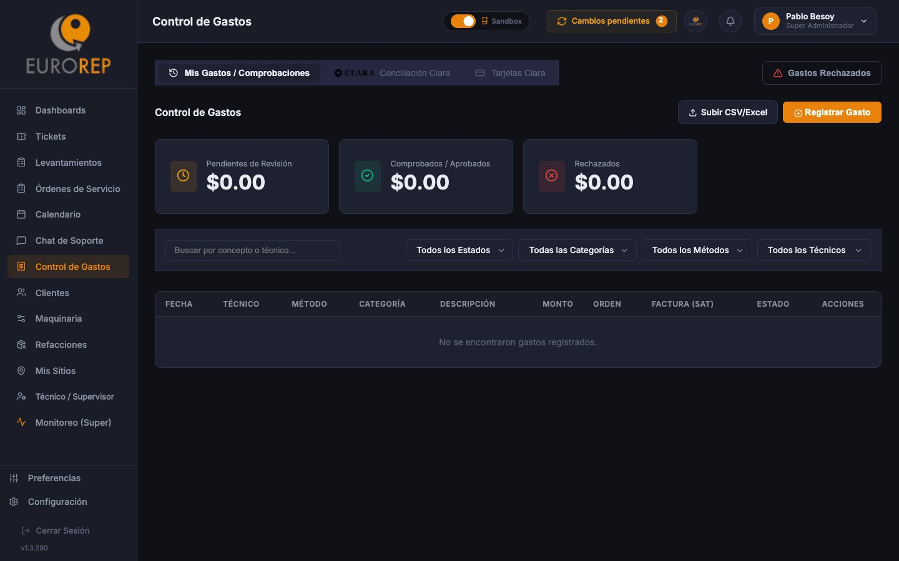

# Manual de Uso: Control de Gastos e Integración Clara (SAPI Postventa)

Esta guía te guiará paso a paso sobre cómo registrar tus gastos de viaje, comprobar tu tarjeta corporativa Clara, digitalizar facturas y realizar la conciliación automatizada en la plataforma **SAPI Postventa**.

---

## 💵 1. Registro Manual de Gastos (Viáticos)

Si realizaste un gasto en campo pagado en efectivo o con tu tarjeta personal (casetas, gasolina, alimentos, etc.) que deba ser reembolsado o comprobado, sigue estos pasos:

1. Ve a la sección **"Control de Gastos"** en el menú lateral.
2. Haz clic en **"Registrar Gasto"**.
3. Completa los campos solicitados:
   * **Fecha del Gasto**: El día en que realizaste la compra.
   * **Concepto**: Breve descripción (ej. *"Gasolina para traslado a Obra Querétaro"*).
   * **Categoría**: Elige entre *Gasolina*, *Casetas*, *Alimentos*, *Hospedaje*, *Herramientas* u *Otros*.
   * **Monto ($)**: El total exacto con centavos.
   * **Moneda**: MXN (por defecto) o USD.
   * **Evidencia**: Haz clic para cargar una foto legible del ticket de compra o recibo desde tu celular.
4. Haz clic en **"Guardar Gasto"**.
5. > [!NOTE]
   > Tu gasto quedará guardado con estatus **"Pendiente de Aprobación"** hasta que el área de administración lo revise. Recibirás una notificación si es rechazado por falta de claridad en el ticket o datos incorrectos.

---

## 💳 2. Tarjetas Corporativas Clara (Vinculación y Comprobación)

Si cuentas con una tarjeta de crédito corporativa **Clara** asignada por Eurorep, puedes vincularla a tu usuario para conciliar tus transacciones directamente:

### Paso 2.1: Vincular tu Tarjeta Clara (Se realiza una sola vez)
1. Dentro de la sección de Gastos, ve a la pestaña **"Mis Tarjetas Clara"**.
2. Haz clic en **"Vincular Tarjeta"**.
3. Escribe los **últimos 4 dígitos** de tu tarjeta física o virtual Clara.
4. Asigna un **Alias** (ej. *"Tarjeta de Campo - [Tu Nombre]"*).
5. Haz clic en **"Vincular"**. A partir de este momento, el sistema jalará tus transacciones de Clara en tiempo real.

### Paso 2.2: Comprobar una Transacción de Clara
1. Ve a la pestaña **"Transacciones Clara"**. Verás la lista de cargos realizados a tu tarjeta.
2. Identifica la transacción correspondiente (ej. *"Cargos Oxxo - $150.00"*).
3. Haz clic en el botón **"Comprobar"** al lado de la transacción.
4. Sube la foto del ticket físico o, de preferencia, sube la **Factura XML/PDF** asociada (ver sección 3).
5. Guarda la comprobación. El estatus de la transacción cambiará a **Comprobada** y se enviará a revisión.

---

## 📄 3. Extractor Inteligente de Facturas (XML y PDF)

Para evitar la captura manual de montos, RFC y folios fiscales, el sistema cuenta con un lector automático de facturas electrónicas:

1. En el módulo de gastos, dirígete a la pestaña **"Subir Facturas"**.
2. Arrastra o selecciona tus archivos de factura (**formato .XML o .PDF**) en el recuadro de carga. Puedes subir varios archivos al mismo tiempo.
3. Haz clic en **"Procesar Facturas"**.
4. El backend de SAPI analizará los archivos mediante un extractor inteligente y obtendrá de forma automática:
   * **Nombre del Emisor (Proveedor)**.
   * **RFC del Emisor**.
   * **Fecha de Emisión**.
   * **Subtotal, Impuestos (IVA/IEPS) y Monto Total**.
   * **UUID (Folio Fiscal digital de 36 caracteres)**.
5. Verás en pantalla una tabla con los datos extraídos para que los confirmes. Si todo es correcto, haz clic en **"Aceptar y Guardar"**. Las facturas quedarán almacenadas en tu inventario digital listas para ser conciliadas.

---

## 🔄 4. Conciliación de Gastos (Administradores)

Este proceso es exclusivo para administradores y supervisores de oficina, y sirve para auditar que todas las compras reportadas correspondan con facturas del SAT válidas:

1. Ve a la sección **"Control de Gastos"** con perfil administrador.
2. Abre la pestaña **"Conciliación de Gastos"**.
3. El sistema te mostrará una pantalla dividida en dos columnas:
   * **Columna Izquierda (Transacciones y Gastos Reportados)**: Cargos a tarjetas Clara y viáticos manuales pendientes de comprobación.
   * **Columna Derecha (Facturas Subidas e Inventariadas)**: Las facturas XML/PDF procesadas por el sistema.
4. **Auto-Conciliación (Sugerencias del Sistema)**:
   * El sistema analizará las fechas, montos y RFC del emisor. Si encuentra coincidencias perfectas o aproximadas, resaltará la sugerencia en color verde.
   * Haz clic en **"Aceptar Conciliación Sugerida"** para enlazar la transacción Clara con la factura electrónica correspondiente.
5. **Conciliación Manual**:
   * Si el sistema no encuentra una coincidencia automática, selecciona la transacción en la columna izquierda y haz clic en la factura correspondiente en la columna derecha.
   * Haz clic en **"Conciliar Seleccionados"**.
6. Una vez conciliado, el gasto cambia a estatus **Aprobado** y se archiva en el historial contable, liberando el saldo de comprobación del técnico.
