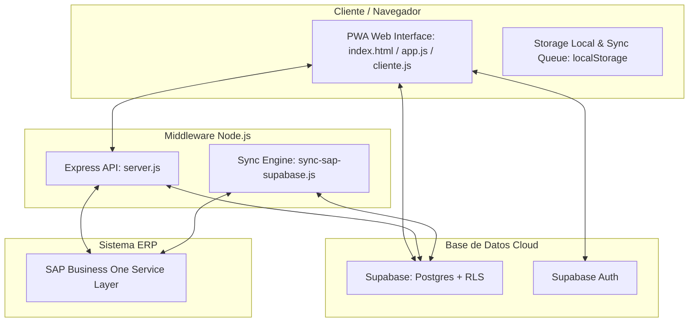

# Manual de Referencia Técnica y de Arquitectura (SAPI Postventa)

Esta guía documenta la arquitectura del sistema, el flujo de sincronización con SAP Business One, la estructura de seguridad en Supabase y las pautas para mantenimiento y desarrollo futuro en la plataforma **SAPI Postventa**.

---

## 🏗️ 1. Arquitectura General del Sistema

SAPI Postventa está diseñado bajo una arquitectura híbrida de tres capas:

### Tecnologías Utilizadas:
1. **Frontend**: Single Page Application (SPA) con HTML5, CSS vanilla, y Javascript nativo (ES6). Convertido a **PWA** mediante un Service Worker (`sw.js`).
   * **Librerías (CDN)**:
     * Lucide Icons (Iconografía)
     * Leaflet (Geolocalización y mapas)
     * FullCalendar (Calendario)
     * Chart.js (Gráficas)
     * SheetJS/xlsx (Exportaciones)
     * HTML2PDF (Generación de hojas de servicio PDF)
2. **Backend / Middleware**: Node.js con Express, alojado localmente o en hosting dedicado, actuando como puente seguro hacia la Service Layer de SAP.
3. **Persistencia / Backend-as-a-Service**: **Supabase** (PostgreSQL) con autenticación integrada y almacenamiento de objetos para evidencias fotográficas.

---

## 🔒 2. Seguridad y Políticas de RLS en Supabase

El sistema delega la lógica de permisos directamente a la base de datos de Supabase mediante **Row-Level Security (RLS)** y funciones Postgres personalizadas (ver [setup_security.sql](file:///Users/pablobesoytrigueros/Library/CloudStorage/Dropbox/DESARROLLOS/Eurorep/setup_security.sql)).

### Helpers de Rol de Usuario (PostgreSQL STABLE Functions):
* `public.get_my_role()`: Recupera el rol (`superadmin`, `admin`, `supervisor`, `tecnico`, `consulta`, `cliente`, `empresa`) del usuario logueado (`auth.uid()`) desde la tabla `user_roles`.
* `public.get_my_name()`: Recupera el nombre completo del usuario activo.
* `public.get_my_empresa()`: Recupera la empresa vinculada al usuario (indispensable para clientes).

### Pautas de Políticas RLS:
* **Órdenes de Servicio (`ordenes`)**:
  * *Admins/Supervisores*: Acceso total (CRUD).
  * *Técnicos*: Solo pueden leer y editar las órdenes donde ellos sean el técnico asignado (`tecnico = get_my_name()`) o su nombre figure en las notas internas.
  * *Clientes*: Solo pueden ver órdenes vinculadas a su código de cliente (`LOWER(cliente) = LOWER(get_my_empresa())`).
* **Control de Gastos (`gastos`)**:
  * *Admins/Supervisores*: Acceso completo.
  * *Técnicos/Consulta*: Solo lectura e inserción sobre sus propios registros (`usuario_id = auth.uid()`).
* **Tarjetas y Transacciones Clara (`clara_cards`, `clara_transactions`)**:
  * Cuentan con políticas para restringir que los técnicos solo vean transacciones de tarjetas vinculadas a su ID (`usuario_vinculado_id = auth.uid()`).

---

## 🔄 3. Motor de Sincronización SAP Business One

La sincronización se realiza mediante dos mecanismos de backend en [backend/sync-sap-supabase.js](file:///Users/pablobesoytrigueros/Library/CloudStorage/Dropbox/DESARROLLOS/Eurorep/backend/sync-sap-supabase.js):

### 3.1. Gestión de Sesión SAP (Persistencia de Cookie)
Para evitar cuellos de botella y errores por exceso de inicios de sesión en SAP Service Layer, el middleware persiste la cookie de sesión (`SessionId`) en la tabla `config` de Supabase (registro `sap_session`).
* Si la sesión en memoria no existe, se recupera de Supabase.
* Si el servidor SAP arroja un error `401 Unauthorized`, un interceptor de Axios realiza un reconexión transparente, actualiza la cookie en Supabase y reintenta la petición original automáticamente.

### 3.2. Script de Sincronización por Lotes (`sync-sap-supabase.js`)
Sincroniza catálogos clave desde SAP hacia Supabase:
1. **Clientes (`clientes`)**: Consulta SAP vía Query SQL personalizado o fallback nativo a OData `/BusinessPartners`. Adicionalmente guarda el saldo actual y saldo de órdenes de compra abiertas en config (`saldos_sap`).
2. **Refacciones (`refacciones`)**: Sincroniza códigos, descripciones, stock, precios, marcas (desde `@OK_MARCA`) y grupos de artículos.
3. **Sitios (`sitios`)**: Direcciones de entrega y obras.
4. **Técnicos (`tecnicos`)**: Empleados registrados en SAP.
5. **Cotizaciones y Pedidos (`cotizaciones_sap`, `pedidos_sap`)**: Cache de cotizaciones y pedidos abiertos para consulta en el portal del cliente.

> [!TIP]
> El script de sincronización realiza cargas masivas en lotes de **500 registros** a Supabase REST API mediante peticiones concurrentes controladas para optimizar el tiempo de ejecución y evitar rebasar límites de API.

---

## 📶 4. Funcionamiento PWA Offline y Cola de Sincronización

El sistema utiliza `localStorage` como base de datos local temporal en dispositivos móviles para dar soporte offline a los técnicos de campo.

### Ciclo de vida de una transacción offline:
1. Si no hay internet, `supabaseSync.js` intercepta la petición de guardado.
2. Los datos de la orden modificada se guardan en el array local `sapi_sync_queue`.
3. Las evidencias fotográficas se codifican en formato **Base64** y se guardan temporalmente en el mismo registro del objeto en `localStorage` (ej. `sapi_ordenes`).
4. Al recuperar conexión:
   * El script de sincronización recorre `sapi_sync_queue`.
   * En caso de haber fotos en Base64, realiza primero la subida al Storage Bucket `evidencias` de Supabase mediante `/storage/v1/object/evidencias/...` convirtiendo el Base64 en un blob binario JPEG.
   * Una vez obtenida la URL pública de la imagen, actualiza el JSON de evidencias de la orden en la tabla `ordenes` de Supabase.
   * Se elimina la tarea de la cola de sincronización.

---

## 📋 5. Extractor de Facturas e Integración de PDFs

Para el módulo de control de gastos, el middleware en `backend/server.js` cuenta con una ruta `/api/extract-pdf` que:
* Recibe un archivo PDF o XML de factura.
* En el caso de XML, realiza un parser XML nativo para extraer los nodos del CFDI (Emisor, Receptor, Conceptos, Impuestos, TimbreFiscalDigital UUID).
* En el caso de PDF, realiza una llamada a una utilidad compilada localmente en Swift (`pdf_extractor.swift` en sistemas macOS) o utiliza librerías de extracción de texto (`pdf.js` / node-pdf) para buscar patrones mediante expresiones regulares (Regex) y capturar RFCs, montos y folios fiscales.
