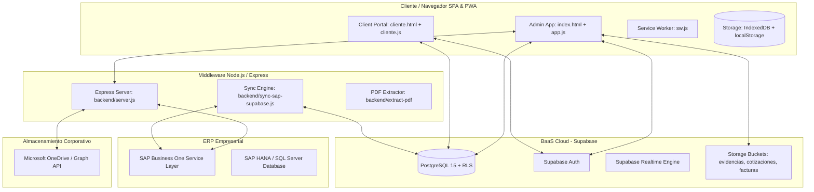

# Manual de Arquitectura Técnica y Referencia para Desarrolladores (SAPI Postventa)

> [!CAUTION]
> **DOCUMENTO ESTRICTAMENTE CONFIDENCIAL — ACCESO EXCLUSIVO: SUPERADMINISTRADOR / SISTEMAS**
> Esta guía documenta la arquitectura interna, diseño de bases de datos, lógica de políticas RLS en Supabase, el motor de sincronización con SAP Business One Service Layer, la arquitectura offline PWA y las pautas para mantenimiento y extensión del código fuente de **SAPI Postventa (Eurorep CRM)**.

---

## 🏗️ 1. Arquitectura General del Sistema

SAPI Postventa opera bajo un modelo de arquitectura distribuida de tres niveles:


```mermaid
graph TD
    subgraph Frontend [Cliente / Navegador SPA & PWA]
        AdminApp[Admin App: index.html + app.js]
        ClientApp[Client Portal: cliente.html + cliente.js]
        SW[Service Worker: sw.js]
        LocalStore[(Storage: IndexedDB + localStorage)]
    end

    subgraph Backend [Middleware Node.js / Express]
        Server[Express Server: backend/server.js]
        SyncEngine[Sync Engine: backend/sync-sap-supabase.js]
        PDFEngine[PDF Extractor: backend/extract-pdf]
    end

    subgraph Database [BaaS Cloud - Supabase]
        Postgres[(PostgreSQL 15 + RLS)]
        Auth[Supabase Auth]
        Realtime[Supabase Realtime Engine]
        Storage[Storage Buckets: evidencias, cotizaciones, facturas]
    end

    subgraph ERP [ERP Empresarial]
        SAP[SAP Business One Service Layer]
        HANA[SAP HANA / SQL Server Database]
    end

    subgraph CloudStorage [Almacenamiento Corporativo]
        OneDrive[Microsoft OneDrive / Graph API]
    end

    AdminApp <--> Postgres
    AdminApp <--> Auth
    AdminApp <--> Storage
    ClientApp <--> Postgres
    ClientApp <--> Auth
    AdminApp <--> Server
    Server <--> SAP
    SyncEngine <--> SAP
    SyncEngine <--> Postgres
    Server <--> OneDrive
```

---

## 🗄️ 2. Diccionario de Datos y Schemas de Base de Datos (PostgreSQL en Supabase)

### 2.1 Tabla: `user_roles`
Almacena la relación entre usuarios autenticados (`auth.users`) y sus roles operativos:
* `id` (UUID, PK, FK -> `auth.users.id`).
* `email` (TEXT, UNIQUE).
* `nombre` (TEXT).
* `rol` (TEXT: `'superadmin'`, `'admin'`, `'supervisor'`, `'tecnico'`, `'consulta'`, `'cliente'`, `'empresa'`).
* `empresa` (TEXT, Razón social para vincular clientes a sus registros).
* `activo` (BOOLEAN, Estado de aprobación de cuenta).
* `created_at` (TIMESTAMPTZ).

### 2.2 Tabla: `clientes`
Socios de negocios sincronizados desde SAP B1:
* `id` (UUID, PK) o `CardCode` (TEXT, PK alternativo).
* `nombre` / `CardName` (TEXT).
* `rfc` / `LicTradNum` (TEXT).
* `telefono` (TEXT), `email` (TEXT), `contacto` (TEXT).
* `saldo_actual` (NUMERIC), `saldo_oc_abiertas` (NUMERIC).

### 2.3 Tabla: `sitios`
Frentes de trabajo, obras y plantas por cliente:
* `id` (UUID, PK).
* `cliente` (TEXT, Nombre o CardCode de la empresa).
* `nombre` (TEXT, Identificador de la obra o planta).
* `direccion` (TEXT), `ciudad` (TEXT), `estado` (TEXT).
* `latitud` (NUMERIC), `longitud` (NUMERIC, Coordenadas GPS).
* `contacto` (TEXT), `telefono` (TEXT).

### 2.4 Tabla: `maquinaria`
Parque de maquinaria y equipos:
* `id` (UUID, PK).
* `serie` (TEXT, UNIQUE, Número de serie físico).
* `marca` (TEXT), `modelo` (TEXT), `anio` (INTEGER).
* `cliente` (TEXT), `sitio` (TEXT, Ubicación actual).
* `horometro` (NUMERIC, Última lectura acumulada).
* `estatus` (TEXT: `'operativo'`, `'mantenimiento'`, `'en_renta'`, `'falla_reportada'`).

### 2.5 Tabla: `rentas`
Contratos de arrendamiento de maquinaria:
* `id` (UUID, PK).
* `folio_renta` (TEXT, Folio único ej. `RNT-26001`).
* `cliente` (TEXT), `sitio` (TEXT).
* `maquinaria_id` (UUID, FK -> `maquinaria.id`), `serie` (TEXT).
* `fecha_inicio` (DATE), `fecha_fin_estimada` (DATE), `fecha_devolucion` (DATE).
* `horometro_inicio` (NUMERIC), `horometro_fin` (NUMERIC).
* `combustible_inicio` (TEXT), `combustible_fin` (TEXT).
* `fotos_checkin` (JSONB), `fotos_checkout` (JSONB).
* `firma_cliente_checkin` (TEXT), `firma_cliente_checkout` (TEXT).
* `estatus` (TEXT: `'activa'`, `'por_vencer'`, `'en_devolucion'`, `'finalizada'`).

### 2.6 Tabla: `tickets`
Expedientes de soporte técnico y solicitudes de servicio:
* `id` (UUID, PK).
* `folio` (TEXT, UNIQUE, ej. `T-26045` o `TKT-26045-A`).
* `cliente` (TEXT), `sitio` (TEXT), `maquinaria` (TEXT), `serie` (TEXT).
* `horometro_reportado` (NUMERIC).
* `categoria` (TEXT: `'Correctivo'`, `'Preventivo'`, `'Refacciones'`, `'Garantía'`).
* `prioridad` (TEXT: `'Baja'`, `'Media'`, `'Alta'`, `'Crítica'`).
* `asunto` (TEXT), `descripcion` (TEXT).
* `evidencias` (JSONB, URLs de fotografías en Supabase Storage).
* `estatus` (TEXT: `'Reportado'`, `'En Curso'`, `'Cotizado'`, `'En Proceso'`, `'Orden de Servicio'`, `'Cerrado'`, `'Refacciones'`).
* `tecnico_asignado` (TEXT), `tecnico_id` (UUID).
* `cotizacion_sap` (TEXT), `monto_cotizacion` (NUMERIC), `url_cotizacion_pdf` (TEXT).
* `pedido_sap` (TEXT), `url_pedido_pdf` (TEXT).
* `orden_compra_cliente_url` (TEXT), `comprobante_pago_url` (TEXT).
* `is_ticket_a` (BOOLEAN, Flag indicador de ticket autogenerado de refacciones de campo).
* `created_at` (TIMESTAMPTZ), `updated_at` (TIMESTAMPTZ).

### 2.7 Tabla: `tickets_comentarios`
Historial de mensajería del ticket:
* `id` (UUID, PK).
* `ticket_id` (UUID, FK -> `tickets.id`).
* `autor` (TEXT), `usuario_id` (UUID, FK -> `auth.users.id`).
* `mensaje` (TEXT).
* `is_staff_only` (BOOLEAN: `true` para notas internas, `false` para chat público).
* `created_at` (TIMESTAMPTZ).

### 2.8 Tabla: `ordenes`
Hojas de servicio oficiales de campo:
* `id` (UUID, PK).
* `folio` (TEXT, UNIQUE, ej. `OS-26045`).
* `ticket_id` (UUID, FK -> `tickets.id`).
* `cliente` (TEXT), `sitio` (TEXT), `maquinaria` (TEXT), `serie` (TEXT).
* `tecnico` (TEXT), `tecnicos_adicionales` (JSONB).
* `fecha_servicio` (DATE).
* `horometro_inicio` (NUMERIC), `horometro_final` (NUMERIC).
* `km_recorridos` (NUMERIC), `tipo_traslado` (TEXT).
* `bitacora_diaria` (JSONB, Array de notas de avance diario, horas de entrada/salida y traslados).
* `checklist_inspeccion` (JSONB, Evaluación de los 15 puntos técnicos).
* `diagnostico` (TEXT), `trabajos_realizados` (TEXT).
* `refacciones_utilizadas` (JSONB, Piezas consumidas con código SAP y cantidad).
* `refacciones_necesarias` (JSONB, Piezas faltantes detectadas en campo).
* `evidencias_fotos` (JSONB, `foto_inicio`, `foto_fin`, `fotos_adicionales`, `foto_horometro`).
* `firma_cliente` (TEXT, DataURL base64), `nombre_firma_cliente` (TEXT), `puesto_firma_cliente` (TEXT).
* `firma_tecnico` (TEXT, DataURL base64).
* `estatus` (TEXT: `'Pendiente'`, `'En Proceso'`, `'Completado'`).
* `url_pdf_onedrive` (TEXT, Ruta en Microsoft OneDrive).

### 2.9 Tablas de Finanzas: `gastos`, `clara_cards`, `clara_transactions`, `facturas_sat`
* `gastos`: Registro de viáticos con `concepto`, `categoria`, `monto`, `moneda`, `evidencia_url`, `estatus` (`'pendiente'`, `'comprobado'`, `'conciliado'`, `'aprobado'`), `usuario_id`.
* `clara_cards`: Tarjetas corporativas con `last_four`, `alias`, `usuario_vinculado_id`.
* `clara_transactions`: Cargos bancarios con `transaction_id`, `amount`, `merchant_name`, `status`, `factura_uuid_vinculada`.
* `facturas_sat`: CFDI procesados con `uuid`, `rfc_emisor`, `razon_social_emisor`, `fecha_emision`, `subtotal`, `iva`, `total`, `xml_url`, `pdf_url`.

---

## 🔒 3. Modelo de Seguridad y Políticas de RLS en Supabase

El sistema utiliza **Row-Level Security (RLS)** estricto en PostgreSQL delegando la validación al motor de base de datos:

### Helpers STABLE en PostgreSQL:
```sql
CREATE OR REPLACE FUNCTION public.get_my_role()
RETURNS text LANGUAGE sql STABLE SECURITY DEFINER AS $$
  SELECT rol FROM public.user_roles WHERE id = auth.uid();
$$;

CREATE OR REPLACE FUNCTION public.get_my_empresa()
RETURNS text LANGUAGE sql STABLE SECURITY DEFINER AS $$
  SELECT empresa FROM public.user_roles WHERE id = auth.uid();
$$;

CREATE OR REPLACE FUNCTION public.get_my_name()
RETURNS text LANGUAGE sql STABLE SECURITY DEFINER AS $$
  SELECT nombre FROM public.user_roles WHERE id = auth.uid();
$$;
```

### Reglas RLS Clave:
1. **Notas Internas de Tickets (`tickets_comentarios`)**:
   ```sql
   CREATE POLICY "Lectura comentarios de tickets" ON public.tickets_comentarios
   FOR SELECT USING (
     (is_staff_only = false) OR 
     (public.get_my_role() IN ('superadmin', 'admin', 'supervisor', 'tecnico'))
   );
   ```
2. **Aislamiento Multitenant de Clientes**:
   ```sql
   CREATE POLICY "Clientes solo ven sus equipos y órdenes" ON public.ordenes
   FOR SELECT USING (
     (public.get_my_role() IN ('superadmin', 'admin', 'supervisor', 'tecnico')) OR
     (LOWER(cliente) = LOWER(public.get_my_empresa()))
   );
   ```

---

## 🔄 4. Motor de Sincronización SAP B1 y Gestión de Sesiones

El script `backend/sync-sap-supabase.js` coordina la ingesta de datos desde SAP Service Layer:

### 4.1 Persistencia de Sesión SAP (Reutilización de Cookie):
* Para no agotar licencias ni ralentizar el ERP, la sesión de SAP Service Layer (`B1SESSION` cookie) se almacena en la tabla `config` de Supabase bajo la clave `sap_session`.
* Al iniciar una llamada a la Service Layer, Axios inyecta la cookie persistida.
* Si el servidor responde `401 Unauthorized`, un interceptor de Axios realiza un re-login automático con las credenciales de servicio, guarda la nueva cookie en Supabase y repite la petición original de forma transparente.

### 4.2 Ingesta por Lotes (Batching de 500 registros):
* Los catálogos masivos (Artículos/Refacciones con más de 10,000 registros) se dividen en chunks de 500 registros procesados mediante `Promise.allSettled` para no saturar los límites de memoria de Node.js ni la API REST de Supabase.

---

## 📶 5. Arquitectura Offline y Manejo de Datos en el Cliente

Para garantizar el funcionamiento 100% desconectado de los técnicos:

```
[UI Input en Campo] ──> [IndexedDB (sapi_db) & LocalStorage] ──> [sapi_sync_queue]
                                                                        │
                             (Al detectar conexión a internet)           ▼
                        [Subida de Fotos Base64 -> Supabase Storage]
                                                                        │
                                                                        ▼
                        [Upsert de Datos JSON -> Supabase Postgres]
```

* **Almacenamiento de Fotos Offline**: Las imágenes capturadas con la cámara del celular se convierten a DataURL Base64 y se guardan temporalmente en IndexedDB.
* **Cola de Sincronización (`sapi_sync_queue`)**: Guarda las transacciones pendientes con timestamp y tipo de operación.
* **Manejador de Recuperación**: Al dispararse el evento `window.addEventListener('online', ...)`, el módulo `supabaseSync.js` recorre la cola, sube los blobs binarios a Supabase Storage Bucket `evidencias`, actualiza las URLs públicas resultantes en el payload y ejecuta el `upsert` en la base de datos PostgreSQL.

---

## 🛠️ 6. Compilación de Documentación a PDF con Puppeteer

La suite de manuales oficiales en PDF se compila automáticamente mediante el script `manuales/generate_manuals_pdf.js` utilizando Google Chrome headless y `puppeteer-core`:
* Interpreta los archivos Markdown en `manuales/*.md`.
* Renderiza el contenido con estilos tipográficos institucionales, resaltado de sintaxis, alertas GitHub Flavored Markdown y membretes de Eurorep.
* Exporta los archivos PDF finales optimizados listos para su distribución y descarga directa en el portal.

---

## 🧪 7. Modo Sandbox y Herramientas de Depuración

* **Modo Sandbox (`sapi_sandbox`)**:
  * Permite ejecutar la aplicación utilizando un prefijo o esquema de base de datos aislado (`sandbox_ordenes`, `sandbox_tickets`) para pruebas y capacitación sin contaminar los registros de producción.
* **Depurador de Inconsistencias**:
  * Las funciones `window.contarOrdenesRefacciones()`, `window.actualizarBadgeDepuradorOrdenes()` y `window.abrirModalDepurarOrdenes()` en `app.js` permiten al Superadmin auditar relaciones huérfanas entre tickets y órdenes de servicio y regenerar enlaces faltantes.

---

## ⚠️ 8. Reglas de Despliegue y Control de Versiones

> [!IMPORTANT]
> **POLÍTICA ESTRICTA DE DESPLIEGUE**:
> * No ejecutar comandos de `git push` ni despliegues automáticos a repositorios remotos o Vercel sin la confirmación y autorización expresa del usuario administrador.
> * Todo desarrollo, prueba y verificación debe realizarse estrictamente en el entorno local.
